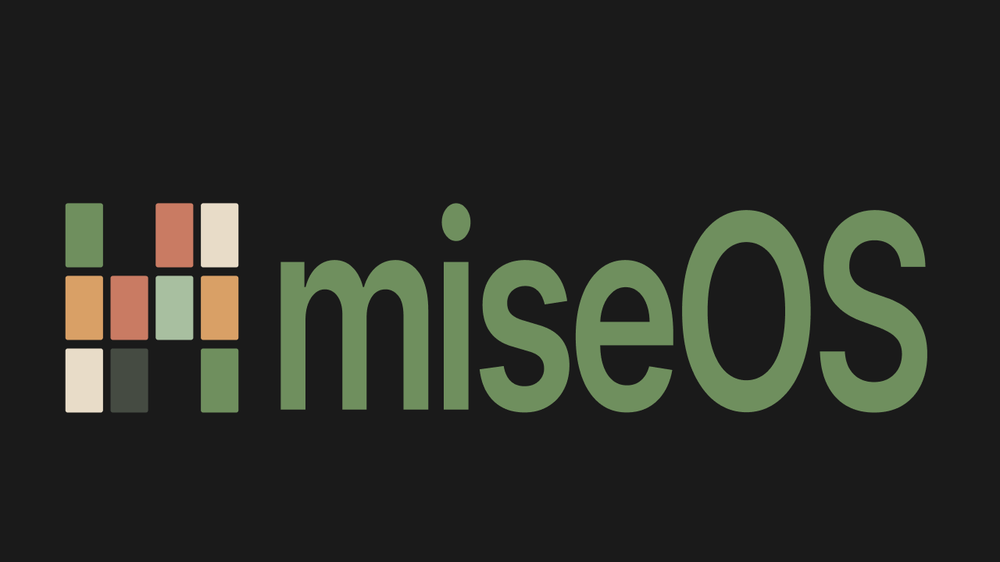
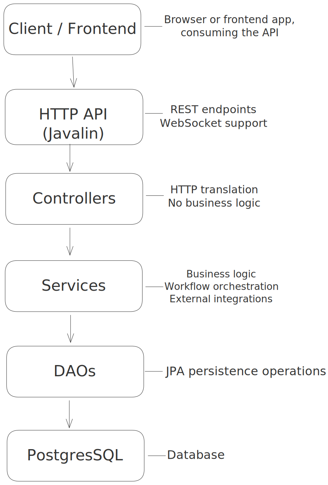
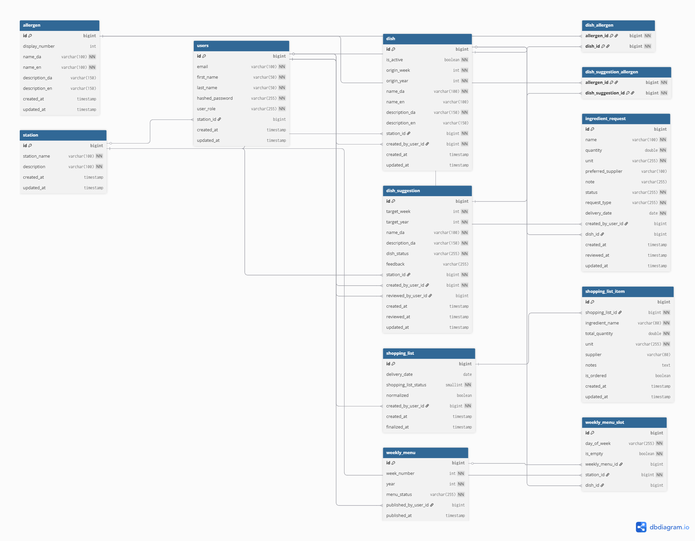

# miseOS



> A kitchen management platform for professional canteens — from dish proposals to published menus.

## Vision

MiseOS digitizes the full kitchen planning workflow: line cooks submit dish proposals for review, head chefs approve and plan weekly menus, ingredient needs are aggregated into AI-normalized shopping lists, and a multilingual public menu is published for guests.

The name references _mise en place_ — the culinary principle of having everything in its place before service.
The goal is to replace fragmented manual planning with a structured, role-based digital workflow.

---

## Links

**Portfolio website:** [corral.dk](https://corral.dk)

**MiseOS project page:** [corral.dk/projects/miseos](https://corral.dk/projects/miseos/)

**Project overview video:** [YouTube demo](https://www.youtube.com/watch?v=Zti71YNXW6o)

**Deployed API:** [miseos.corral.dk/api/v1](https://miseos.corral.dk/api/v1)

**Full API documentation:** [corral.dk/docs/miseos-api-doc](https://corral.dk/docs/miseos-api-doc/)

**Source code:** [github.com/Mortenjenne/miseOS](https://github.com/Mortenjenne/miseOS)

---

## Problem Statement

Menu planning in many canteens relies on fragmented, analog processes:

- Chefs write proposals on paper or in Word documents and share them verbally
- The head chef assembles a weekly menu manually from separate inputs
- Ingredient needs are communicated ad hoc with no consolidated purchasing view
- Printed menus are static and require manual translation for international guests

MiseOS solves these by providing a centralized backend where data is entered once and flows through the entire kitchen workflow — from proposal to published menu to shopping list.

---

## Architecture

### System Overview  

The backend follows a layered architecture separating HTTP handling, domain logic, and persistence. Dependencies flow in one direction only, preventing tight coupling and improving maintainability.

  

### Key Architectural Decisions

**Rich domain model** — Entities guard their own invariants. Business rules live on the entity (`suggestion.approve(user)`, `list.finalizeShoppingList()`), not scattered across services.
Entities are encapsulated and expose behavior instead of public setters.

**JWT-based security** — Authentication and authorization are implemented using JWT tokens. Security checks run as `beforeMatched` filters in Javalin, ensuring that requests are authenticated before reaching controllers. Controllers never validate tokens directly, and services receive a verified `AuthenticatedUser` when identity information is required.

**Middleware pipeline** — Cross-cutting concerns such as request logging, exception handling, and security filters are implemented as Javalin middleware in `ServerConfig`. This keeps controllers focused on request handling while shared concerns are handled centrally.

**Interface segregation** — Components depend on small, focused interfaces rather than large service classes. Most services and controllers interact through interfaces (`IUserService`, `IDishDAO`, etc.), which improves testability and reduces coupling.

A concrete example is the `NotificationService`, which implements two separate interfaces: `INotificationSender` for application services and `INotificationRegistry` for WebSocket connection management. This ensures that each component only depends on the behavior it actually needs.

**AI with fallback** — Gemini AI normalizes ingredient names when generating shopping lists. If normalization fails, the list is still created using original ingredient names. The client falls back to a secondary model if the API returns a `503 Service Unavailable` response.

---

## Technology Stack  

| Concern          | Technology                | Version |
|------------------|---------------------------|---------|
| Language         | Java                      | 17 |
| Build            | Maven                     | - |
| HTTP framework   | Javalin                   | 7.0.1 |
| ORM              | Hibernate / JPA           | 7.2.3.Final |
| Database         | PostgreSQL                | 16 (runtime), JDBC 42.7.7 |
| Authentication   | Nimbus JOSE + JWT         | 10.7 |
| Password hashing | jBCrypt                   | 0.4 |
| JSON             | Jackson Databind + JSR310 | 2.21.1 |
| Logging          | SLF4J + Logback           | 2.0.17 / 1.5.32 |
| Boilerplate reduction | Lombok               | 1.18.42 |
| AI integration   | Gemini API                | flash models |
| Translation      | DeepL API                 | - |
| Weather          | Open-Meteo API            | - |
| Real-time        | WebSocket + SSE           | via Javalin |
| Testing          | JUnit (Jupiter)           | 6.0.2 |
| API testing      | REST-assured              | 6.0.0 |
| Test infrastructure | Testcontainers         | 2.0.3 |
| Deployment       | Docker, Docker Compose    | - |
| CI/CD            | GitHub Actions            | - |
| Reverse proxy    | Caddy                     | - |
| Auto-deploy      | Watchtower                | - |

---

## Application Configuration and Dependency Injection

Application startup and dependency wiring are handled through dedicated configuration classes.

The system uses a manual dependency injection approach. A central `DIContainer` acts as a lightweight inversion-of-control mechanism that constructs and wires all application components during startup.

Dependencies follow the application layers: controllers depend on services, and services depend on DAOs. Dependencies are provided through constructor injection, ensuring that components remain loosely coupled and easy to test.

External APIs such as Gemini, DeepL, and Open-Meteo are accessed through dedicated client classes. These clients encapsulate HTTP communication and keep third-party logic isolated from the core application services.

Key configuration components are:

|Class|Responsibility|
|---|---|
|`ApplicationConfig`|Starts the Javalin server and initializes the application|
|`ServerConfig`|Registers middleware, exception handling, and route modules|
|`DIContainer`|Creates and wires all application dependencies (DAOs, services, controllers)|
|`HibernateConfig`|Configures the database connection and EntityManagerFactory|
|`ApiConfig`|Loads environment variables and external API configuration|

---

## Data Model  

### Core Entities

|Entity|Description|
|---|---|
|`User`|Kitchen staff with a single `UserRole` (HEAD_CHEF, SOUS_CHEF, LINE_COOK) and optional station assignment|
|`Station`|Kitchen section (Hot Kitchen, Cold Kitchen, Pastry, etc.)|
|`Allergen`|EU standard allergens — 14 entries, each with Danish/English names|
|`DishSuggestion`|Proposal submitted by a cook for a target week. Status: `PENDING → APPROVED / REJECTED`|
|`Dish`|Approved dish in the bank — bilingual, linked to a station, can be active or inactive|
|`WeeklyMenu`|A menu for a specific ISO week. Contains slots per day and station. Status: `DRAFT → PUBLISHED`|
|`WeeklyMenuSlot`|One day/station entry in a weekly menu — optionally linked to a dish|
|`IngredientRequest`|A cook's request for an ingredient, linked to a dish or general stock. Status: `PENDING → APPROVED / REJECTED`|
|`ShoppingList`|AI-generated aggregation of approved ingredient requests. Status: `DRAFT → FINALIZED`|
|`ShoppingListItem`|One line on a shopping list — normalized name, summed quantity, most common supplier|

### Key Relationships

- `User` belongs to one `Station`
- `DishSuggestion` belongs to a `Station`, created by a `User`, reviewed by a `User`
- `Dish` belongs to a `Station`, has many `Allergens` (ManyToMany)
- `WeeklyMenu` has many `WeeklyMenuSlots`, each optionally linked to a `Dish`
- `IngredientRequest` optionally linked to a `Dish`, created by a `User`
- `ShoppingList` has many `ShoppingListItems`, created by a `User`


### ERD  



---

## API  

**Base URL:** `https://miseos.corral.dk/api/v1`

Full documentation: [corral.dk/miseos-api-doc](https://corral.dk/docs/miseos-api-doc/)

### Authentication

All endpoints except login, register and public menu view, require a JWT token:

```
Authorization: Bearer <token>
```

Tokens are obtained via `POST /auth/login` and expire after 30 minutes.

### Roles  

|Role|Access|
|---|---|
|`HEAD_CHEF`|Full access — approvals, publishing, role changes|
|`SOUS_CHEF`|Management access — most operations|
|`LINE_COOK`|Own resources — requests, suggestions, read access|
|`ANYONE`|Public endpoints — no token required|

### Endpoint Summary  

| Resource            | Endpoints                                                     |
| ------------------- | ------------------------------------------------------------- |
| Auth                | `POST /auth/login`, `POST /auth/register`                     |
| Users               | CRUD + role/email/password/station patch                      |
| Allergens           | CRUD + search + EU seed                                       |
| Stations            | CRUD                                                          |
| Dish Suggestions    | CRUD + approve/reject + allergen removal                      |
| Dishes              | CRUD + activate/deactivate + search + grouped/available views |
| Weekly Menus        | CRUD + slot management + translate + publish                  |
| Ingredient Requests | CRUD + approve/reject                                         |
| Shopping Lists      | Generate + finalize + item management                         |
| Notifications       | WebSocket + snapshot                                          |
| Menu Inspirations   | AI daily + SSE stream                                         |

### Example: Login request  

```http request
POST /api/v1/auth/login
Content-Type: application/json

{
  "email": "gordon@kitchen.com",
  "password": "Password123"
}
```

### Example response  

```json
{
  "token": "eyJhbGci...",
  "email": "gordon@kitchen.com",
  "role": "HEAD_CHEF"
}
```

### Example: Generate Shopping List  

```http request
POST /api/v1/shopping-lists
Authorization: Bearer <token>
Content-Type: application/json

{
  "deliveryDate": "2026-04-01",
  "targetLanguage": "DA"
}
```

Response includes AI-normalized ingredient items aggregated from all approved requests for that date.

---

## User Stories  

- As a line cook, I can submit dish suggestions for a target week.
- As head/sous chef, I can approve or reject suggestions.
- As management, I can create, translate, and publish weekly menus.
- As kitchen staff, I can submit ingredient requests.
- As management, I can generate and finalize shopping lists from approved requests.
- As a guest, I can view published weekly menu without login.
- As staff/management, I receive live updates via notifications.
- As a user, I authenticate with JWT and access role-protected endpoints.

This section shows a **subset** of the project’s user stories.
For the full story set, including acceptance cricteria, see `docs/user-stories.md`.

---

## Testing  

The project uses **JUnit (Jupiter)** and includes **400+ automated tests** across:

- **Unit tests** (small isolated logic)
- **DAO tests** (persistence behavior)
- **Controller/API integration tests** with **REST-assured** and **Testcontainers (PostgreSQL)**

Integration tests are grouped into:

- **Happy path** — operation succeeds with valid input and correct role
- **Role enforcement** — operation is blocked for users without required role  
- **State conflict** — operation is blocked because the resource is in the wrong state

JWT tokens are obtained via a real login call in `TestAuthenticationUtil` before each test run, so authentication is tested end-to-end.

---

## Deployment  

The application is deployed on a DigitalOcean droplet via Docker Compose.

**CI/CD pipeline (GitHub Actions):**

1. `test` job — runs all tests with real secrets injected from GitHub Secrets
2. `deploy` job — builds Docker image, pushes to Docker Hub (only on `main` after tests pass)
3. Watchtower webhook — pulls the new image and restarts the container automatically

**Infrastructure:**

- Caddy handles reverse proxy and automatic HTTPS for `miseos.corral.dk`
- PostgreSQL runs as a sibling container on the `backend` network
- Logs are mounted to `./logs` for persistence across restarts

---

## Portfolio Log  

| Post     | Topic                                                        |
| -------- | ------------------------------------------------------------ |
| Week 1   | Project setup and initial domain modelling                   |
| Week 2–3 | DAO layer, Hibernate configuration, entity design            |
| Week 4–5 | Service layer, business logic, external API integrations     |
| Week 6–7 | REST-assured integration testing and WebSocket notifications |
| Week 8   | JWT authentication and role-based authorization              |
| Week 9   | CI/CD pipeline and production deployment                     |
| Week 10  | API documentation                                            |

Full portfolio with weekly posts: [corral.dk/posts](https://corral.dk/posts)

---

## Scope Status  

**Implemented (Done):** Epics 1–8 (US-01 to US-25).  
The core backend workflow is complete and production-ready: authentication, role-based authorization, dish suggestion lifecycle, weekly menu publishing, ingredient requests, AI-assisted shopping lists, and real-time notifications.

**In Progress (Developing):** Epic 9 (US-26 to US-28).  
Takeaway functionality is currently being implemented (offer lifecycle, portion tracking, and sales summary).

**Planned (Future / Nice-to-have):** Epic 9 (US-29 to US-30).  
External payment-service guest count import are planned for the next phase.
